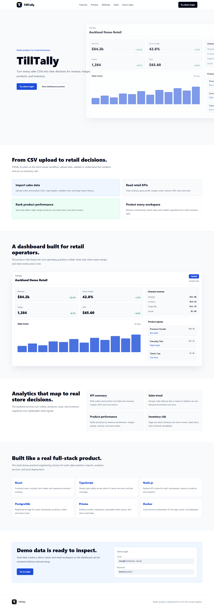
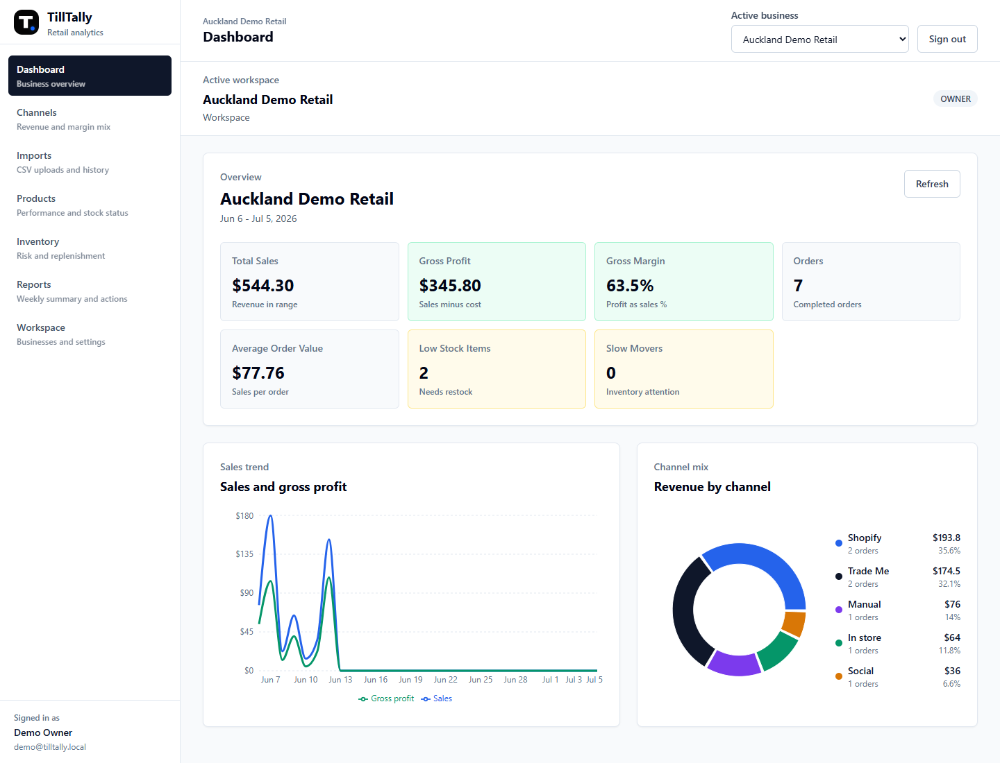
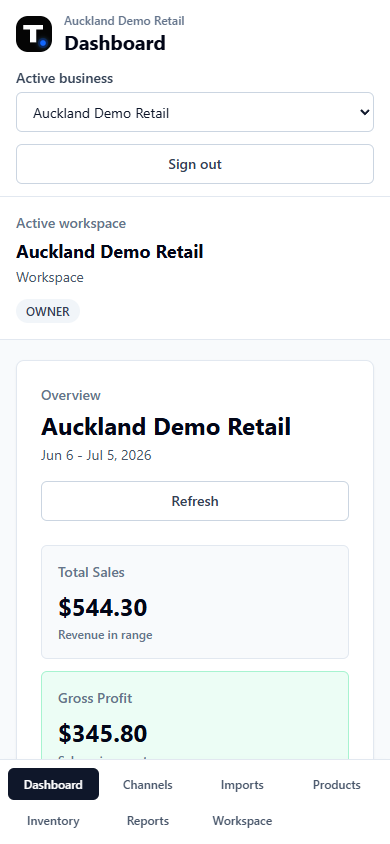
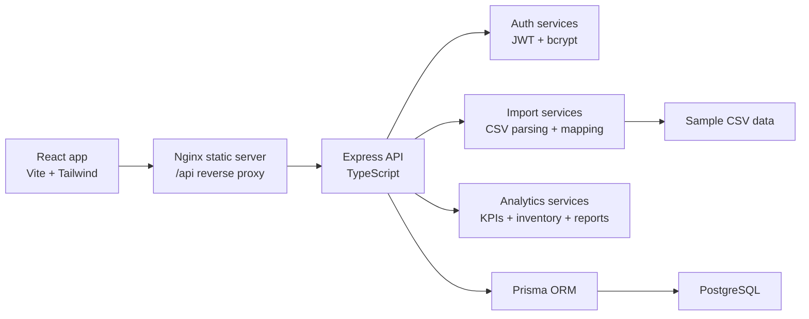

# TillTally

Retail business analytics for small retailers, charity shops, and small e-commerce sellers.
TillTally turns CSV exports into clear KPIs, product performance, inventory-risk alerts,
channel analysis, and weekly business reports without enterprise BI complexity.

TillTally answers five store-owner questions:

- How much did we sell?
- How much gross profit did we make?
- Which products performed best?
- Which products need inventory action?
- Which channels are working best?

## Demo

Run the seed script to create a portfolio-ready demo workspace.

```text
Email: demo@tilltally.local
Password: DemoPass123!
Workspace: Auckland Demo Retail
```

## Screenshots

### Landing Page



### Dashboard



### Mobile Layout



## Features

- Authentication with JWT access tokens, httpOnly refresh cookies, and hashed passwords
- Business workspaces with per-business data isolation
- CSV imports for orders, products, inventory snapshots, and import job history
- Smart import preview, header aliases, column mapping, and row-level correction helpers
- KPI summary for revenue, gross profit, margin, orders, AOV, units, and inventory risk
- Sales trend and channel breakdown analytics
- Product performance ranking with status labels
- Inventory risk detection for low stock, stockout risk, slow movers, dead stock, and overstock
- Weekly report generation with top products, warnings, and suggested actions
- Responsive React dashboard with mobile navigation

## Architecture



## Tech Stack

| Layer | Technology |
| --- | --- |
| Frontend | React 18, TypeScript, Vite, Tailwind CSS, Recharts |
| Backend | Node.js, Express, TypeScript |
| Database | PostgreSQL, Prisma ORM |
| Auth | JWT, bcrypt, httpOnly refresh cookies |
| Imports | Multer, csv-parse, Papa Parse |
| Tooling | npm workspaces, ESLint, Prettier, GitHub Actions |
| Deployment | Docker, Nginx |

## Monorepo Structure

```text
till-tally/
├── client/        # React + TypeScript + Vite + Tailwind frontend
├── server/        # Express + TypeScript API
├── docs/          # API, database, screenshots, deployment docs
├── sample-data/   # Demo CSV files used by the seed script
├── package.json   # npm workspaces and root scripts
└── docker-compose.yml
```

## Getting Started

### Prerequisites

- Node.js 20+ and npm 10+
- Docker Desktop or Docker Engine with Docker Compose

### Install Dependencies

```bash
git clone https://github.com/hannnnnnnny/till-tally.git
cd till-tally
npm install
```

On Windows PowerShell, use `npm.cmd` if script execution policy blocks `npm`.

### Configure Environment

Copy the example files and fill in local secrets:

```bash
cp server/.env.example server/.env
cp client/.env.example client/.env
```

Generate strong JWT secrets:

```bash
openssl rand -hex 32
```

Secrets are read from environment variables and must not be committed.

The natural-language analytics planner works locally without an AI service. To optionally use a
local Ollama model for additional phrasing, run Ollama separately and set these server-only values:

```bash
ANALYTICS_PLANNER_PROVIDER=ollama
OLLAMA_BASE_URL=http://127.0.0.1:11434
OLLAMA_MODEL=qwen3:4b
```

Ollama is an enhancement, not a production dependency. Model configuration is never exposed to the
React client, and provider output is schema-validated before it can become an analytics plan.

### Run the Database

```bash
docker compose up -d db
docker compose ps
```

The local database uses development defaults that match `server/.env.example`.
Data is stored in a Docker volume. To reset local data:

```bash
docker compose down -v
```

### Seed Demo Data

```bash
npm run db:seed
```

This creates the demo user, business workspace, products, orders, inventory snapshots,
and import jobs from `sample-data/*.csv`.

The seed script is blocked when `NODE_ENV=production` unless
`ALLOW_PRODUCTION_SEED=true` is set for an intentional one-off demo data reset.

### Run in Development

```bash
npm run dev:server
npm run dev:client
```

| Service | URL |
| --- | --- |
| Client | <http://localhost:5173> |
| API health check | <http://localhost:4000/api/health> |

### Run the Full Stack in Docker

```bash
docker compose up -d --build
```

| Service | URL |
| --- | --- |
| Client | <http://localhost:8080> |
| API health check | <http://localhost:4000/api/health> |
| PostgreSQL | `localhost:5432` |

## Scripts

Run from the repository root:

| Script | Description |
| --- | --- |
| `npm run dev:client` | Start the Vite dev server |
| `npm run dev:server` | Start the API with hot reload |
| `npm run build` | Build client and server |
| `npm run db:seed` | Seed demo data from sample CSV files |
| `npm run typecheck` | Type-check both workspaces |
| `npm run lint` | Lint with ESLint |
| `npm run format` | Format with Prettier |
| `npm run format:check` | Check formatting without writing |

## Documentation

| Document | Description |
| --- | --- |
| [docs/API.md](docs/API.md) | REST API endpoints, request/response shapes, errors, and auth |
| [docs/DATABASE.md](docs/DATABASE.md) | Database schema, ERD, Prisma models, indexes, and isolation rules |
| [docs/DEPLOYMENT.md](docs/DEPLOYMENT.md) | Ubuntu, Docker Compose, Nginx, HTTPS, backups, and release steps |

The full product plan lives in `TT.md`.

## Security and Privacy

- Passwords are hashed before storage.
- Refresh tokens are stored in httpOnly cookies.
- Access tokens are short-lived.
- Every business-scoped request is checked against membership before data is returned.
- CSV uploads enforce file type, generated filenames, path stripping, and size limits.
- Imports avoid customer PII such as names, emails, phone numbers, addresses, and payment details.

## Roadmap

Work is tracked on the [TillTally project board](https://github.com/users/hannnnnnnny/projects/2)
across epics A-G: foundation, auth, workspace, import, analytics, frontend, reporting, and deployment.

## License

[MIT](LICENSE)
