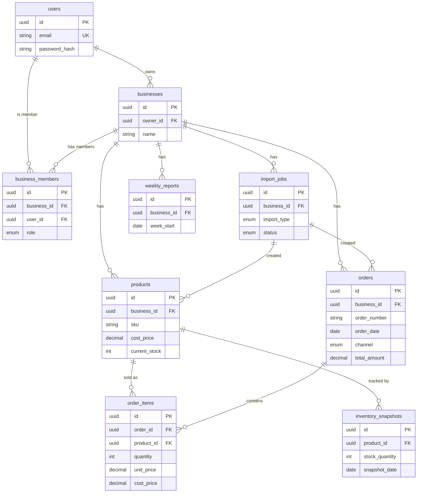

# TillTally — Database Design

> Status: Design draft (MVP) · Database: PostgreSQL 15+ · ORM: Prisma
> Source of truth for scope: [`TT.md`](../TT.md) §15. This document refines those tables into a production-ready relational schema.

---

## 1. Design Goals

1. **Business-level data isolation** — every row of business data is scoped to a `business_id`. A user can only read/write data for businesses they belong to. This is the single most important invariant.
2. **Analytics-friendly** — orders, order items and inventory snapshots are modelled so that KPI, margin, ranking and inventory-risk queries are simple and indexable.
3. **Import traceability** — every imported row can be traced back to the `import_job` that created it, so a bad import can be diagnosed (and later rolled back).
4. **Privacy-aware** — no customer PII (names, email, phone, address, payment). At most a coarse `customer_region` string for channel/region analysis. See [`TT.md`](../TT.md) §6.3 / §22.
5. **Money is never a float** — all monetary and quantity values use `Decimal` (PostgreSQL `numeric`) to avoid rounding errors in margin calculations.

---

## 2. Entity Relationship Overview



---

## 3. Conventions

| Concern | Decision | Reason |
|---|---|---|
| Primary keys | `UUID` (v4), `id` column | Non-guessable, safe to expose in URLs, no cross-business sequence leakage |
| Timestamps | `created_at`, `updated_at` (`timestamptz`, UTC) | Auditing; UTC avoids timezone bugs |
| Money | `Decimal(12,2)` | Exact currency math; supports up to ~9.9 billion |
| Quantities | `Integer` (qty), `Decimal(12,4)` (rates) | Whole units; rates need fractional precision |
| Naming | `snake_case` tables/columns, plural tables | PostgreSQL convention |
| Soft delete | Not in MVP | Keep simple; deletion handled by cascading FK |
| Enums | PostgreSQL native enums via Prisma | Validation at DB layer |

---

## 4. Enumerations

```text
Role          : OWNER | ADMIN | ANALYST | VIEWER          # MVP uses OWNER only
SalesChannel  : SHOPIFY | TRADE_ME | IN_STORE | SOCIAL | MANUAL | OTHER
ImportType    : ORDERS | PRODUCTS | INVENTORY
ImportStatus  : PENDING | PROCESSING | COMPLETED | COMPLETED_WITH_WARNINGS | FAILED
```

> Channel is an enum to keep analytics buckets consistent. Unknown CSV channel values are mapped to `OTHER` and flagged as an import warning rather than rejected.

---

## 5. Tables

### 5.1 `users`

| Column | Type | Constraints | Notes |
|---|---|---|---|
| `id` | uuid | PK, default `gen_random_uuid()` | |
| `name` | varchar(120) | not null | |
| `email` | varchar(255) | not null, **unique** (lowercased) | Login identity |
| `password_hash` | varchar(255) | not null | bcrypt/argon2 — never store plaintext |
| `created_at` | timestamptz | not null, default now() | |
| `updated_at` | timestamptz | not null | |

**Indexes:** unique on `lower(email)`.
**Security:** `password_hash` is never returned by any API. See [`TT.md`](../TT.md) §22.

---

### 5.2 `businesses`

| Column | Type | Constraints | Notes |
|---|---|---|---|
| `id` | uuid | PK | |
| `owner_id` | uuid | FK → `users.id`, not null | Creator/owner |
| `name` | varchar(160) | not null | e.g. "Auckland Charity Store" |
| `industry` | varchar(80) | nullable | Retail / E-commerce |
| `city` | varchar(80) | nullable | |
| `created_at` | timestamptz | not null | |
| `updated_at` | timestamptz | not null | |

**Indexes:** `(owner_id)`.
**On delete:** deleting a business cascades to products, orders, import_jobs, weekly_reports.

---

### 5.3 `business_members`

Junction table for future multi-user workspaces. MVP inserts one `OWNER` row per business.

| Column | Type | Constraints | Notes |
|---|---|---|---|
| `id` | uuid | PK | |
| `business_id` | uuid | FK → `businesses.id`, not null | cascade delete |
| `user_id` | uuid | FK → `users.id`, not null | cascade delete |
| `role` | Role | not null, default `OWNER` | |
| `created_at` | timestamptz | not null | |

**Indexes:** **unique** `(business_id, user_id)` — a user joins a business once.
**Authorisation:** this table is the gate for data isolation — every protected query joins through it. See §8.

---

### 5.4 `products`

| Column | Type | Constraints | Notes |
|---|---|---|---|
| `id` | uuid | PK | |
| `business_id` | uuid | FK → `businesses.id`, not null | cascade delete |
| `sku` | varchar(64) | not null | Stock keeping unit |
| `name` | varchar(200) | not null | |
| `category` | varchar(80) | nullable | For category-level margin/ABC analysis |
| `vendor` | varchar(120) | nullable | |
| `cost_price` | decimal(12,2) | not null, ≥ 0 | COGS basis for margin |
| `current_stock` | integer | not null, default 0, ≥ 0 | Latest known stock |
| `last_sold_at` | date | nullable | Denormalised from order_items for fast slow-mover/dead-stock detection |
| `import_job_id` | uuid | FK → `import_jobs.id`, nullable | Provenance |
| `created_at` | timestamptz | not null | |
| `updated_at` | timestamptz | not null | |

**Indexes:**
- **unique** `(business_id, sku)` — SKU is unique *within* a business, not globally.
- `(business_id, category)` — category filters/aggregations.
- `(business_id, last_sold_at)` — slow-mover / dead-stock scans.

> `last_sold_at` and `current_stock` are maintained by the import/analytics service when orders or inventory snapshots are imported, so dashboard queries avoid recomputing from scratch.

---

### 5.5 `orders`

Order header. One row per order/transaction.

| Column | Type | Constraints | Notes |
|---|---|---|---|
| `id` | uuid | PK | |
| `business_id` | uuid | FK → `businesses.id`, not null | cascade delete |
| `order_number` | varchar(64) | not null | From source system |
| `order_date` | date | not null | Drives time-series KPIs |
| `channel` | SalesChannel | not null, default `OTHER` | |
| `total_amount` | decimal(12,2) | not null, ≥ 0 | Gross order value |
| `discount_amount` | decimal(12,2) | not null, default 0, ≥ 0 | |
| `customer_region` | varchar(80) | nullable | Coarse region only — no PII |
| `import_job_id` | uuid | FK → `import_jobs.id`, nullable | Provenance |
| `created_at` | timestamptz | not null | |

**Indexes:**
- **unique** `(business_id, order_number)` — dedupe; re-importing the same order is rejected/skipped.
- `(business_id, order_date)` — sales-trend and date-range queries.
- `(business_id, channel)` — channel analysis.

---

### 5.6 `order_items`

Order line. The grain of most analytics (revenue, margin, units, product ranking).

| Column | Type | Constraints | Notes |
|---|---|---|---|
| `id` | uuid | PK | |
| `order_id` | uuid | FK → `orders.id`, not null | cascade delete |
| `product_id` | uuid | FK → `products.id`, nullable | Null if SKU not matched at import (logged as warning) |
| `sku` | varchar(64) | not null | Snapshot of SKU at import time |
| `quantity` | integer | not null, > 0 | |
| `unit_price` | decimal(12,2) | not null, ≥ 0 | Selling price per unit |
| `total_price` | decimal(12,2) | not null, ≥ 0 | `quantity * unit_price` (validated) |
| `cost_price` | decimal(12,2) | not null, ≥ 0 | COGS per unit at sale time (snapshot) |
| `created_at` | timestamptz | not null | |

**Indexes:**
- `(order_id)` — load lines for an order.
- `(product_id)` — per-product aggregation (units, revenue, margin).

> **Why snapshot `sku` and `cost_price` on the line?** Cost changes over time; storing the cost *at the time of sale* makes historical gross-margin accurate and independent of later `products.cost_price` edits. A nullable `product_id` lets us import order lines whose SKU isn't (yet) in the products table and still surface the revenue, while flagging the mismatch.

**Derived (not stored):**
```text
line_gross_profit = total_price - (quantity * cost_price)
line_gross_margin = line_gross_profit / NULLIF(total_price, 0)
```

---

### 5.7 `inventory_snapshots`

Point-in-time stock levels, used for stock-trend and days-of-stock-left calculations.

| Column | Type | Constraints | Notes |
|---|---|---|---|
| `id` | uuid | PK | |
| `product_id` | uuid | FK → `products.id`, not null | cascade delete |
| `stock_quantity` | integer | not null, ≥ 0 | |
| `snapshot_date` | date | not null | |
| `created_at` | timestamptz | not null | |

**Indexes:** **unique** `(product_id, snapshot_date)` — one snapshot per product per day; `(product_id, snapshot_date DESC)` for latest-stock lookups.

---

### 5.8 `import_jobs`

Tracks every CSV upload and its outcome. See [`TT.md`](../TT.md) §10.3 / §23.

| Column | Type | Constraints | Notes |
|---|---|---|---|
| `id` | uuid | PK | |
| `business_id` | uuid | FK → `businesses.id`, not null | cascade delete |
| `file_name` | varchar(255) | not null | Original filename (sanitised) |
| `import_type` | ImportType | not null | ORDERS / PRODUCTS / INVENTORY |
| `status` | ImportStatus | not null, default `PENDING` | |
| `rows_total` | integer | not null, default 0 | |
| `rows_imported` | integer | not null, default 0 | |
| `rows_failed` | integer | not null, default 0 | |
| `error_summary` | jsonb | nullable | Structured per-row errors (row #, column, message) |
| `created_at` | timestamptz | not null | |

**Indexes:** `(business_id, created_at DESC)` — import history list.
**Note:** `error_summary` as `jsonb` lets the frontend render a downloadable error report (see API `GET /import/jobs/:id`).

---

### 5.9 `weekly_reports`

Generated weekly business summary. See [`TT.md`](../TT.md) §10.8.

| Column | Type | Constraints | Notes |
|---|---|---|---|
| `id` | uuid | PK | |
| `business_id` | uuid | FK → `businesses.id`, not null | cascade delete |
| `week_start` | date | not null | Monday of the report week |
| `week_end` | date | not null | |
| `summary` | text | not null | Human-readable narrative |
| `sales_change_percent` | decimal(6,2) | nullable | vs previous week |
| `top_category` | varchar(80) | nullable | |
| `low_stock_count` | integer | not null, default 0 | |
| `slow_mover_count` | integer | not null, default 0 | |
| `created_at` | timestamptz | not null | |

**Indexes:** **unique** `(business_id, week_start)` — one report per business per week (idempotent regeneration).

---

## 6. Prisma Schema (reference)

```prisma
// server/src/prisma/schema.prisma
generator client {
  provider = "prisma-client-js"
}

datasource db {
  provider = "postgresql"
  url      = env("DATABASE_URL")
}

enum Role          { OWNER ADMIN ANALYST VIEWER }
enum SalesChannel  { SHOPIFY TRADE_ME IN_STORE SOCIAL MANUAL OTHER }
enum ImportType    { ORDERS PRODUCTS INVENTORY }
enum ImportStatus  { PENDING PROCESSING COMPLETED COMPLETED_WITH_WARNINGS FAILED }

model User {
  id           String           @id @default(uuid())
  name         String
  email        String           @unique
  passwordHash String           @map("password_hash")
  ownedBusinesses Business[]    @relation("BusinessOwner")
  memberships  BusinessMember[]
  createdAt    DateTime         @default(now()) @map("created_at")
  updatedAt    DateTime         @updatedAt @map("updated_at")
  @@map("users")
}

model Business {
  id        String           @id @default(uuid())
  ownerId   String           @map("owner_id")
  owner     User             @relation("BusinessOwner", fields: [ownerId], references: [id])
  name      String
  industry  String?
  city      String?
  members   BusinessMember[]
  products  Product[]
  orders    Order[]
  importJobs ImportJob[]
  reports   WeeklyReport[]
  createdAt DateTime         @default(now()) @map("created_at")
  updatedAt DateTime         @updatedAt @map("updated_at")
  @@index([ownerId])
  @@map("businesses")
}

model BusinessMember {
  id         String   @id @default(uuid())
  businessId String   @map("business_id")
  business   Business @relation(fields: [businessId], references: [id], onDelete: Cascade)
  userId     String   @map("user_id")
  user       User     @relation(fields: [userId], references: [id], onDelete: Cascade)
  role       Role     @default(OWNER)
  createdAt  DateTime @default(now()) @map("created_at")
  @@unique([businessId, userId])
  @@map("business_members")
}

model Product {
  id           String   @id @default(uuid())
  businessId   String   @map("business_id")
  business     Business @relation(fields: [businessId], references: [id], onDelete: Cascade)
  sku          String
  name         String
  category     String?
  vendor       String?
  costPrice    Decimal  @map("cost_price") @db.Decimal(12, 2)
  currentStock Int      @default(0) @map("current_stock")
  lastSoldAt   DateTime? @map("last_sold_at") @db.Date
  importJobId  String?  @map("import_job_id")
  orderItems   OrderItem[]
  snapshots    InventorySnapshot[]
  createdAt    DateTime @default(now()) @map("created_at")
  updatedAt    DateTime @updatedAt @map("updated_at")
  @@unique([businessId, sku])
  @@index([businessId, category])
  @@index([businessId, lastSoldAt])
  @@map("products")
}

model Order {
  id             String       @id @default(uuid())
  businessId     String       @map("business_id")
  business       Business     @relation(fields: [businessId], references: [id], onDelete: Cascade)
  orderNumber    String       @map("order_number")
  orderDate      DateTime     @map("order_date") @db.Date
  channel        SalesChannel @default(OTHER)
  totalAmount    Decimal      @map("total_amount") @db.Decimal(12, 2)
  discountAmount Decimal      @default(0) @map("discount_amount") @db.Decimal(12, 2)
  customerRegion String?      @map("customer_region")
  importJobId    String?      @map("import_job_id")
  items          OrderItem[]
  createdAt      DateTime     @default(now()) @map("created_at")
  @@unique([businessId, orderNumber])
  @@index([businessId, orderDate])
  @@index([businessId, channel])
  @@map("orders")
}

model OrderItem {
  id         String   @id @default(uuid())
  orderId    String   @map("order_id")
  order      Order    @relation(fields: [orderId], references: [id], onDelete: Cascade)
  productId  String?  @map("product_id")
  product    Product? @relation(fields: [productId], references: [id])
  sku        String
  quantity   Int
  unitPrice  Decimal  @map("unit_price") @db.Decimal(12, 2)
  totalPrice Decimal  @map("total_price") @db.Decimal(12, 2)
  costPrice  Decimal  @map("cost_price") @db.Decimal(12, 2)
  createdAt  DateTime @default(now()) @map("created_at")
  @@index([orderId])
  @@index([productId])
  @@map("order_items")
}

model InventorySnapshot {
  id            String   @id @default(uuid())
  productId     String   @map("product_id")
  product       Product  @relation(fields: [productId], references: [id], onDelete: Cascade)
  stockQuantity Int      @map("stock_quantity")
  snapshotDate  DateTime @map("snapshot_date") @db.Date
  createdAt     DateTime @default(now()) @map("created_at")
  @@unique([productId, snapshotDate])
  @@map("inventory_snapshots")
}

model ImportJob {
  id           String       @id @default(uuid())
  businessId   String       @map("business_id")
  business     Business     @relation(fields: [businessId], references: [id], onDelete: Cascade)
  fileName     String       @map("file_name")
  importType   ImportType   @map("import_type")
  status       ImportStatus @default(PENDING)
  rowsTotal    Int          @default(0) @map("rows_total")
  rowsImported Int          @default(0) @map("rows_imported")
  rowsFailed   Int          @default(0) @map("rows_failed")
  errorSummary Json?        @map("error_summary")
  createdAt    DateTime     @default(now()) @map("created_at")
  @@index([businessId, createdAt])
  @@map("import_jobs")
}

model WeeklyReport {
  id                 String   @id @default(uuid())
  businessId         String   @map("business_id")
  business           Business @relation(fields: [businessId], references: [id], onDelete: Cascade)
  weekStart          DateTime @map("week_start") @db.Date
  weekEnd            DateTime @map("week_end") @db.Date
  summary            String
  salesChangePercent Decimal? @map("sales_change_percent") @db.Decimal(6, 2)
  topCategory        String?  @map("top_category")
  lowStockCount      Int      @default(0) @map("low_stock_count")
  slowMoverCount     Int      @default(0) @map("slow_mover_count")
  createdAt          DateTime @default(now()) @map("created_at")
  @@unique([businessId, weekStart])
  @@map("weekly_reports")
}
```

---

## 7. Indexing Strategy (analytics)

| Query | Index used |
|---|---|
| Sales trend over date range | `orders(business_id, order_date)` |
| Revenue/orders by channel | `orders(business_id, channel)` |
| Top products by revenue/units | `order_items(product_id)` + join to `orders(business_id, order_date)` |
| Product list filtered by category | `products(business_id, category)` |
| Slow mover / dead stock scan | `products(business_id, last_sold_at)` |
| Latest stock per product | `inventory_snapshots(product_id, snapshot_date DESC)` |
| Import history | `import_jobs(business_id, created_at DESC)` |

For heavier deployments, a future **materialised view** `product_performance_mv` (per business: units, revenue, gross_profit, margin, last_sold) can be refreshed after each import to keep the Product Performance page fast. Out of MVP scope.

---

## 8. Data Isolation & Authorisation

The core security invariant (see [`TT.md`](../TT.md) §22 and global security rules):

> A request may only touch rows whose `business_id` belongs to a business the authenticated user is a member of.

Implementation:
1. JWT carries `userId`.
2. Auth middleware loads the user.
3. A `requireBusinessAccess` middleware reads `:businessId` (param) or the active business, and checks a `business_members` row exists for `(business_id, user_id)`. If not → `403`.
4. **Every** query that reads business data includes `where: { businessId }` — never trust a client-supplied id without the membership check.

This prevents IDOR (insecure direct object reference): even with a valid token, user A cannot read business B's orders.

---

## 9. Data Integrity Rules (enforced at import + DB)

| Rule | Where |
|---|---|
| `email` unique, lowercased | DB unique index + app |
| SKU unique within business | DB `@@unique([businessId, sku])` |
| Order number unique within business (dedupe) | DB `@@unique([businessId, orderNumber])` |
| `quantity > 0`, prices `≥ 0`, stock `≥ 0` | App validation (CHECK constraints recommended) |
| `total_price ≈ quantity * unit_price` (tolerance) | Import validation; warning on mismatch |
| Unknown channel → `OTHER` + warning | Import service |
| One inventory snapshot per product/day | DB `@@unique([productId, snapshotDate])` |

> CHECK constraints (e.g. `CHECK (quantity > 0)`) are recommended as a defence-in-depth layer in addition to app validation, added via a Prisma migration `Unsupported`/raw SQL step.

---

## 10. Seed & Sample Data

`sample-data/orders.csv`, `order_items.csv`, `products.csv` (see [`TT.md`](../TT.md) §17) drive a `prisma db seed` script that creates a demo user + business so the dashboard is populated for screenshots and the live demo.

---

## 11. Open Questions / Future Work

- **Roll-back of a bad import:** store `import_job_id` on created rows (already modelled) so a job can be reverted. Deferred to post-MVP.
- **Multi-currency:** MVP assumes a single currency (NZD). A `currency` column on `businesses`/`orders` would be needed later.
- **Materialised views** for product performance (see §7).
- **Soft delete / data export & deletion** to satisfy the privacy "delete imported data" goal in [`TT.md`](../TT.md) §22.
