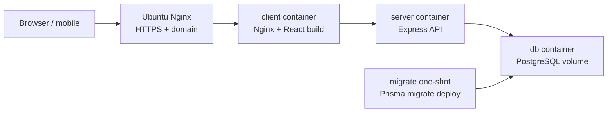

# Ubuntu Deployment

This guide deploys TillTally on an Ubuntu server with Docker Compose. A host-level
Nginx reverse proxy terminates HTTPS and forwards traffic to the client container.
The client container serves the React build and proxies `/api/*` to the Express API.

## Target Architecture



## Prerequisites

- Ubuntu 22.04 or 24.04 server
- A domain name pointing to the server
- SSH access with a sudo-capable user
- Ports 80 and 443 open to the internet
- Port 22 restricted to trusted IPs when possible

## 1. Install Server Packages

```bash
sudo apt update
sudo apt install -y ca-certificates curl git nginx ufw
```

Install Docker Engine and the Compose plugin:

```bash
sudo install -m 0755 -d /etc/apt/keyrings
curl -fsSL https://download.docker.com/linux/ubuntu/gpg |
  sudo gpg --dearmor -o /etc/apt/keyrings/docker.gpg
sudo chmod a+r /etc/apt/keyrings/docker.gpg

echo \
  "deb [arch=$(dpkg --print-architecture) signed-by=/etc/apt/keyrings/docker.gpg] https://download.docker.com/linux/ubuntu \
  $(. /etc/os-release && echo "$VERSION_CODENAME") stable" |
  sudo tee /etc/apt/sources.list.d/docker.list > /dev/null

sudo apt update
sudo apt install -y docker-ce docker-ce-cli containerd.io docker-buildx-plugin docker-compose-plugin
sudo usermod -aG docker "$USER"
```

Log out and back in so the Docker group change applies, then verify:

```bash
docker --version
docker compose version
```

## 2. Clone the Repository

```bash
sudo mkdir -p /opt/till-tally
sudo chown "$USER":"$USER" /opt/till-tally
git clone https://github.com/hannnnnnnny/till-tally.git /opt/till-tally
cd /opt/till-tally
```

## 3. Configure Production Environment

```bash
cp .env.production.example .env.production
nano .env.production
```

Required changes:

- Set `PUBLIC_APP_URL` to the real HTTPS URL.
- Replace `POSTGRES_PASSWORD` with a strong database password.
- Replace both JWT secrets with unique random values.
- Keep `APP_BIND_ADDRESS=127.0.0.1` so only host Nginx can reach the client container.

Generate secrets:

```bash
openssl rand -hex 32
```

Do not commit `.env.production`.

## 4. Build, Migrate, and Start Containers

Start PostgreSQL first:

```bash
docker compose --env-file .env.production -f docker-compose.prod.yml up -d --build db
```

Apply Prisma migrations:

```bash
docker compose --env-file .env.production -f docker-compose.prod.yml run --rm migrate
```

Start the API and client:

```bash
docker compose --env-file .env.production -f docker-compose.prod.yml up -d --build server client
docker compose --env-file .env.production -f docker-compose.prod.yml ps
```

Check the API through the local client proxy:

```bash
curl -i http://127.0.0.1:8080/api/health
```

Expected response:

```json
{"status":"ok","service":"till-tally-api"}
```

## 5. Configure Host Nginx

Create `/etc/nginx/sites-available/till-tally`:

```nginx
server {
    listen 80;
    server_name tilltally.example.com;

    client_max_body_size 25m;

    location / {
        proxy_pass http://127.0.0.1:8080;
        proxy_http_version 1.1;
        proxy_set_header Host $host;
        proxy_set_header X-Real-IP $remote_addr;
        proxy_set_header X-Forwarded-For $proxy_add_x_forwarded_for;
        proxy_set_header X-Forwarded-Proto $scheme;
    }
}
```

Enable the site:

```bash
sudo ln -s /etc/nginx/sites-available/till-tally /etc/nginx/sites-enabled/till-tally
sudo nginx -t
sudo systemctl reload nginx
```

## 6. Add HTTPS

Install Certbot:

```bash
sudo apt install -y certbot python3-certbot-nginx
```

Issue and install the certificate:

```bash
sudo certbot --nginx -d tilltally.example.com
```

Verify renewal:

```bash
sudo certbot renew --dry-run
```

## 7. Firewall

```bash
sudo ufw allow OpenSSH
sudo ufw allow 'Nginx Full'
sudo ufw enable
sudo ufw status
```

Do not open PostgreSQL or the Express API directly to the internet. In the production
compose file, PostgreSQL has no host port and the API is exposed only inside Docker.

## 8. Updates

```bash
cd /opt/till-tally
git pull --ff-only origin main
docker compose --env-file .env.production -f docker-compose.prod.yml build
docker compose --env-file .env.production -f docker-compose.prod.yml run --rm migrate
docker compose --env-file .env.production -f docker-compose.prod.yml up -d server client
docker compose --env-file .env.production -f docker-compose.prod.yml ps
```

## 9. Backups and Restore

Create a backup:

```bash
docker compose --env-file .env.production -f docker-compose.prod.yml exec -T db \
  sh -c 'pg_dump -U "$POSTGRES_USER" "$POSTGRES_DB"' > tilltally-$(date +%Y%m%d-%H%M).sql
```

Restore a backup:

```bash
cat backup.sql | docker compose --env-file .env.production -f docker-compose.prod.yml exec -T db \
  sh -c 'psql -U "$POSTGRES_USER" "$POSTGRES_DB"'
```

## 10. Operational Checks

```bash
docker compose --env-file .env.production -f docker-compose.prod.yml logs -f server
docker compose --env-file .env.production -f docker-compose.prod.yml logs -f client
curl -I https://tilltally.example.com
curl -i https://tilltally.example.com/api/health
```

## Security Checklist

- Use unique JWT secrets and a strong database password.
- Keep `.env.production` outside git.
- Keep PostgreSQL unexposed to the public internet.
- Bind the client container to `127.0.0.1` and expose the public app only through host Nginx.
- Terminate HTTPS with Certbot-managed certificates.
- Keep `client_max_body_size` aligned with `MAX_UPLOAD_SIZE_MB`.
- Run migrations before starting a new release.
- Back up the PostgreSQL volume before destructive maintenance.
